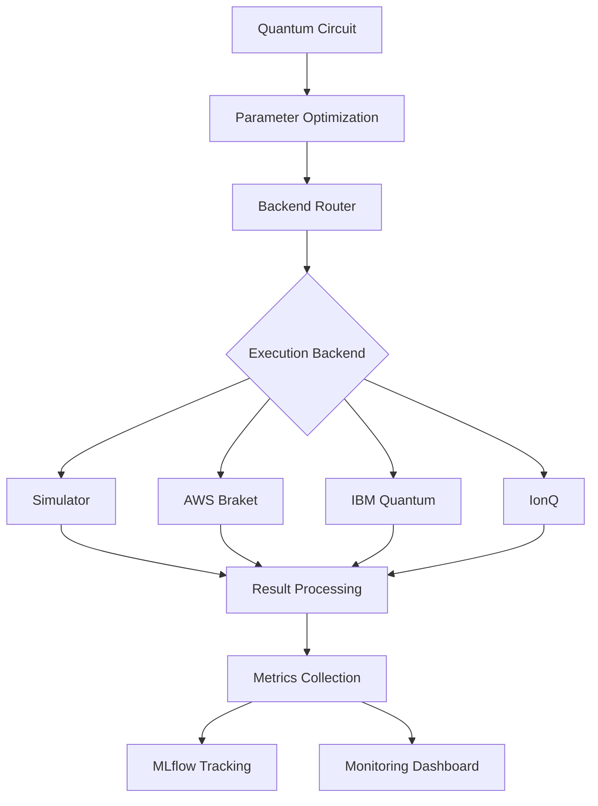

# Quantum MLOps Workbench Architecture

## Overview

The Quantum MLOps Workbench provides a comprehensive framework for developing, testing, and deploying quantum machine learning models with CI/CD best practices.

## System Architecture



## Core Components

### 1. Quantum ML Pipeline (`quantum_mlops.core`)

**QuantumMLPipeline**: Main orchestrator for quantum ML workflows
- **Responsibilities**: Circuit compilation, parameter optimization, backend routing
- **Key Methods**: `train()`, `evaluate()`, `deploy()`
- **Backend Support**: Simulator, AWS Braket, IBM Quantum, IonQ

**QuantumModel**: Trained quantum ML model container
- **State Management**: Circuit parameters, quantum state vectors
- **Serialization**: Model persistence and loading
- **Hardware Compatibility**: Cross-backend model deployment

### 2. Testing Framework (`quantum_mlops.testing`)

**QuantumTestCase**: Base class for quantum-specific testing
- **Gradient Stability**: Variance analysis under noise
- **Hardware Compatibility**: Gate decomposition validation
- **Noise Resilience**: Performance degradation testing

**Test Categories**:
- **Unit Tests**: Individual component validation
- **Integration Tests**: End-to-end workflow testing
- **Quantum Tests**: Hardware-specific validation

### 3. Monitoring System (`quantum_mlops.monitoring`)

**QuantumMonitor**: Real-time metrics collection
- **Quantum Metrics**: Fidelity, entanglement, coherence tracking
- **Classical Metrics**: Loss, accuracy, convergence rates
- **MLflow Integration**: Experiment tracking and comparison

### 4. CLI Tools (`quantum_mlops.cli`)

**Command Interface**: 
- `quantum-mlops test`: Backend testing and validation
- `quantum-mlops analyze`: Metrics analysis and reporting
- `quantum-mlops monitor`: Real-time dashboard
- `quantum-mlops status`: Backend availability checking

## Backend Abstraction Layer

### Supported Quantum Backends

| Backend | Provider | Qubits | Coherence | Queue Time | Cost Model |
|---------|----------|--------|-----------|------------|------------|
| Simulator | Local | 30+ | ∞ | Instant | Free |
| AWS Braket | Amazon | 25 | 15ms | <1 min | Per-shot |
| IBM Quantum | IBM | 127 | 100μs | 5-30 min | Credits |
| IonQ | IonQ | 11 | >1s | <5 min | Per-shot |

### Backend Router Logic

```python
def select_backend(requirements):
    if requirements.speed == "fast":
        return QuantumDevice.SIMULATOR
    elif requirements.noise_model == "realistic":
        return select_hardware_backend(requirements)
    else:
        return optimize_cost_performance(requirements)
```

## Data Flow Architecture

### Training Pipeline

1. **Circuit Definition**: Parameterized quantum circuits
2. **Data Encoding**: Classical data → quantum states
3. **Parameter Optimization**: Gradient-based or gradient-free
4. **Backend Execution**: Quantum computation
5. **Result Processing**: Quantum → classical data
6. **Metrics Collection**: Performance and quantum-specific metrics

### Testing Pipeline

1. **Test Discovery**: Quantum-aware test collection
2. **Backend Selection**: Automatic or manual backend routing
3. **Noise Simulation**: Realistic error modeling
4. **Hardware Validation**: Gate set and topology checking
5. **Performance Analysis**: Benchmark comparison

## Integration Points

### MLflow Integration
- **Experiment Tracking**: Automatic logging of quantum metrics
- **Model Registry**: Versioned quantum model storage
- **Deployment**: Model serving infrastructure

### CI/CD Integration
- **GitHub Actions**: Automated testing workflows
- **Pre-commit Hooks**: Code quality and quantum circuit validation
- **Hardware Testing**: Scheduled quantum backend testing

### Monitoring Integration
- **Real-time Dashboards**: Quantum state visualization
- **Alerting**: Performance degradation notifications
- **Resource Tracking**: Quantum backend usage monitoring

## Security Considerations

### Quantum-Specific Security
- **Circuit Obfuscation**: Protection of proprietary quantum algorithms
- **Hardware Access Control**: Secure backend authentication
- **Noise Injection**: Detection of adversarial quantum noise

### Classical Security
- **API Key Management**: Secure backend credential storage
- **Data Encryption**: Classical data protection
- **Audit Logging**: Comprehensive access tracking

## Performance Optimization

### Circuit Optimization
- **Gate Reduction**: Minimize circuit depth
- **Hardware Mapping**: Optimal qubit allocation
- **Noise Mitigation**: Error correction and suppression

### Resource Management
- **Queue Optimization**: Efficient hardware scheduling
- **Batch Processing**: Multiple circuit execution
- **Caching**: Simulator result caching

## Extensibility

### Plugin Architecture
- **Custom Backends**: Pluggable quantum hardware support
- **Noise Models**: Extensible error simulation
- **Optimization Algorithms**: Custom parameter optimization

### API Design
- **RESTful API**: HTTP-based quantum ML services
- **GraphQL**: Flexible quantum data queries  
- **gRPC**: High-performance quantum computation

## Deployment Models

### Local Development
- **Simulator-based**: Fast iteration and debugging
- **Docker Containers**: Consistent development environment
- **Jupyter Integration**: Interactive quantum ML development

### Cloud Deployment
- **Kubernetes**: Scalable quantum ML services
- **Serverless**: Event-driven quantum computation
- **Multi-cloud**: Cross-provider quantum resource utilization

### Edge Deployment
- **Quantum-classical Hybrid**: Local classical, remote quantum
- **Resource Constraints**: Optimized for limited hardware
- **Offline Capability**: Cached quantum results