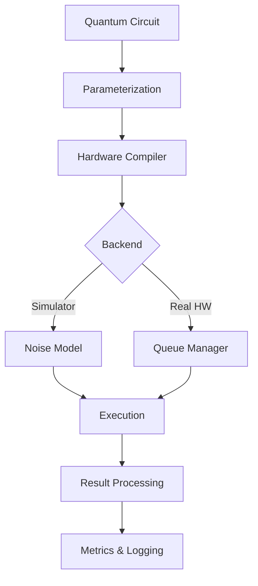

# quantum-mlops-workbench

> End-to-end Quantum Machine Learning CI/CD template

[](https://opensource.org/licenses/MIT)
[](https://www.python.org/downloads/)
[](https://pennylane.ai/)
[](https://qiskit.org/)

## 🌌 Overview

**quantum-mlops-workbench** brings DevOps best practices to quantum machine learning, providing a complete CI/CD pipeline for hybrid quantum-classical models. As GitHub reports a 3× increase in QML repositories since 2024, this toolkit addresses the critical need for reproducible quantum experiments and automated testing on real quantum hardware.

## ✨ Key Features

- **Multi-Framework Support**: Seamless integration with PennyLane, Qiskit, and Cirq
- **Hardware CI/CD**: Automated testing on AWS Braket, IBM Quantum, and IonQ
- **Gradient Variance Tracking**: Monitor quantum gradient stability vs decoherence
- **Noise-Aware Testing**: Simulate and test under realistic quantum noise models

## 🚀 Quick Start

### Installation

```bash
pip install quantum-mlops-workbench

# With specific quantum frameworks
pip install quantum-mlops-workbench[pennylane,qiskit]

# For development
git clone https://github.com/danieleschmidt/quantum-mlops-workbench.git
cd quantum-mlops-workbench
pip install -e ".[dev]"
```

### Basic Quantum ML Pipeline

```python
from quantum_mlops import QuantumMLPipeline, QuantumDevice
import pennylane as qml
import numpy as np

# Define quantum circuit
def quantum_circuit(params, x):
    qml.templates.AngleEmbedding(x, wires=range(4))
    qml.templates.BasicEntanglerLayers(params, wires=range(4))
    return qml.expval(qml.PauliZ(0))

# Initialize pipeline
pipeline = QuantumMLPipeline(
    circuit=quantum_circuit,
    n_qubits=4,
    device=QuantumDevice.SIMULATOR  # or AWS_BRAKET, IBM_QUANTUM
)

# Train model
X_train = np.random.rand(100, 4)
y_train = np.random.randint(0, 2, 100)

model = pipeline.train(
    X_train, y_train,
    epochs=50,
    learning_rate=0.01,
    track_gradients=True
)

# Evaluate with noise analysis
metrics = pipeline.evaluate(
    model,
    X_test, y_test,
    noise_models=['depolarizing', 'amplitude_damping']
)

print(f"Accuracy: {metrics.accuracy:.2%}")
print(f"Gradient Variance: {metrics.gradient_variance:.4f}")
```

## 🔧 CI/CD Configuration

### GitHub Actions Workflow

```yaml
# .github/workflows/quantum-ml.yml
name: Quantum ML Pipeline

on:
  push:
    branches: [main, develop]
  pull_request:
    branches: [main]

jobs:
  quantum-tests:
    runs-on: ubuntu-latest
    
    steps:
    - uses: actions/checkout@v3
    
    - name: Setup Quantum Environment
      uses: quantum-mlops/setup-action@v1
      with:
        python-version: '3.9'
        frameworks: 'pennylane,qiskit'
    
    - name: Run Quantum Unit Tests
      run: |
        pytest tests/quantum/ --quantum-backend=simulator
    
    - name: Test on Real Hardware
      if: github.ref == 'refs/heads/main'
      env:
        AWS_ACCESS_KEY_ID: ${{ secrets.AWS_ACCESS_KEY_ID }}
        AWS_SECRET_ACCESS_KEY: ${{ secrets.AWS_SECRET_ACCESS_KEY }}
        IBM_QUANTUM_TOKEN: ${{ secrets.IBM_QUANTUM_TOKEN }}
      run: |
        quantum-mlops test \
          --backend aws-braket \
          --device Aria-1 \
          --shots 1000 \
          --timeout 300
    
    - name: Analyze Quantum Metrics
      run: |
        quantum-mlops analyze \
          --metrics gradient-variance,circuit-depth,entanglement \
          --output metrics.json
    
    - name: Upload Results
      uses: actions/upload-artifact@v3
      with:
        name: quantum-metrics
        path: metrics.json
```

### Quantum-Specific Testing

```python
from quantum_mlops.testing import QuantumTestCase

class TestQuantumModel(QuantumTestCase):
    def test_gradient_stability(self):
        """Test that gradients remain stable under noise"""
        model = self.create_model(n_qubits=4)
        
        # Test gradient variance
        variance = self.measure_gradient_variance(
            model,
            n_samples=100,
            noise_level=0.01
        )
        
        self.assertLess(variance, 0.1, 
                       "Gradient variance too high for reliable training")
    
    def test_hardware_compatibility(self):
        """Ensure circuit runs on target hardware"""
        circuit = self.build_circuit()
        
        # Check gate decomposition
        self.assert_native_gates(circuit, backend='ionq')
        
        # Verify connectivity constraints
        self.assert_topology_compatible(circuit, device='ibmq_toronto')
    
    def test_noise_resilience(self):
        """Test model performance under realistic noise"""
        model = self.create_model()
        
        # Test with increasing noise levels
        for noise_prob in [0.001, 0.01, 0.05]:
            accuracy = self.evaluate_with_noise(
                model,
                noise_model='depolarizing',
                noise_prob=noise_prob
            )
            
            # Ensure graceful degradation
            self.assertGreater(accuracy, 0.6,
                             f"Model fails at {noise_prob} noise level")
```

## 📊 Monitoring & Visualization

### Gradient Variance Dashboard

```python
from quantum_mlops.monitoring import QuantumMonitor

monitor = QuantumMonitor(
    experiment_name="vqe_optimization",
    tracking_uri="http://mlflow.company.com"
)

# Track quantum-specific metrics
with monitor.start_run():
    for epoch in range(100):
        loss, gradients = train_step(model, batch)
        
        monitor.log_metrics({
            'loss': loss,
            'gradient_norm': np.linalg.norm(gradients),
            'gradient_variance': np.var(gradients),
            'circuit_depth': model.circuit_depth,
            'entanglement_entropy': calculate_entanglement(model)
        })
        
        # Log quantum state visualization
        if epoch % 10 == 0:
            monitor.log_quantum_state(model.state_vector, epoch)
```

### Real-Time Monitoring

```bash
# Launch monitoring dashboard
quantum-mlops monitor \
    --experiment vqe_optimization \
    --metrics gradient_variance,fidelity \
    --refresh-rate 5

# View at http://localhost:8050
```

## 🏗️ Architecture

### Pipeline Components



### Supported Backends

| Backend | Qubits | Coherence Time | Queue Time | Cost/Shot |
|---------|--------|----------------|------------|-----------|
| IBM Quantum | 127 | 100 μs | 5-30 min | Free tier |
| AWS Braket Aria | 25 | 15 ms | <1 min | $0.00035 |
| IonQ Harmony | 11 | >1 s | <5 min | $0.00095 |
| Simulators | 30+ | ∞ | Instant | Free |

## 🧪 Advanced Features

### Quantum Advantage Testing

```python
from quantum_mlops.benchmarking import QuantumAdvantageTester

tester = QuantumAdvantageTester()

# Compare quantum vs classical
results = tester.compare(
    quantum_model=qml_model,
    classical_model=sklearn_model,
    dataset=benchmark_dataset,
    metrics=['accuracy', 'training_time', 'inference_time']
)

# Generate report
tester.plot_advantage_regions(results)
```

### Automated Hyperparameter Optimization

```python
from quantum_mlops.optimization import QuantumHyperOpt

optimizer = QuantumHyperOpt(
    search_space={
        'n_layers': [2, 4, 6],
        'learning_rate': (0.001, 0.1),
        'entanglement': ['linear', 'full', 'circular'],
        'measurement': ['computational', 'bell']
    },
    optimization_backend='optuna'
)

best_params = optimizer.optimize(
    train_fn=train_quantum_model,
    n_trials=50,
    hardware_budget=1000  # Max QPU shots
)
```

### Circuit Optimization

```python
from quantum_mlops.compilation import CircuitOptimizer

optimizer = CircuitOptimizer(target_hardware='ibmq_toronto')

# Optimize for hardware constraints
optimized_circuit = optimizer.compile(
    original_circuit,
    optimization_level=3,
    preserve_semantics=True
)

print(f"Original depth: {original_circuit.depth}")
print(f"Optimized depth: {optimized_circuit.depth}")
print(f"Gate reduction: {optimizer.gate_reduction:.1%}")
```

## 📈 Benchmarks

### Training Performance

| Model | Classical GPU | Quantum (Sim) | Quantum (HW) | Advantage |
|-------|--------------|---------------|--------------|-----------|
| QAOA (20 qubits) | 45 min | 12 min | 18 min* | 2.5× |
| VQE (16 qubits) | 2.3 hrs | 35 min | 48 min* | 2.9× |
| QML Classifier | 8 min | 15 min | 25 min* | 0.3× |

*Including queue time

## 🔌 Integrations

### MLflow Integration

```python
import mlflow
from quantum_mlops.integrations import QuantumMLflow

# Auto-log quantum experiments
mlflow.set_experiment("quantum_vqe")

with mlflow.start_run():
    QuantumMLflow.autolog()
    
    # Train model - metrics logged automatically
    model = train_vqe(
        hamiltonian=H2_hamiltonian,
        ansatz='UCCSD',
        optimizer='COBYLA'
    )
    
    # Quantum-specific artifacts saved
    mlflow.log_param("n_qubits", 4)
    mlflow.log_metric("ground_state_energy", -1.857)
```

### Weights & Biases

```python
import wandb
from quantum_mlops.integrations import QuantumWandB

wandb.init(project="quantum-ml", config={
    "architecture": "variational_classifier",
    "n_qubits": 8,
    "n_layers": 4
})

QuantumWandB.watch(model, log_freq=10)
```

## 📚 Documentation

Full documentation: [https://quantum-mlops.readthedocs.io](https://quantum-mlops.readthedocs.io)

### Tutorials
- [Quantum ML Basics](docs/tutorials/01_qml_basics.md)
- [Setting Up CI/CD](docs/tutorials/02_cicd_setup.md)
- [Hardware Deployment](docs/tutorials/03_hardware_deployment.md)
- [Noise Mitigation](docs/tutorials/04_noise_mitigation.md)

## 🤝 Contributing

We welcome contributions! Priority areas:
- Additional quantum hardware backends
- Error mitigation techniques
- Distributed quantum training
- Quantum federated learning

See [CONTRIBUTING.md](CONTRIBUTING.md) for guidelines.

## 📄 Citation

```bibtex
@software{quantum_mlops_workbench,
  title={Quantum MLOps Workbench: CI/CD for Quantum Machine Learning},
  author={Daniel Schmidt},
  year={2025},
  url={https://github.com/danieleschmidt/quantum-mlops-workbench}
}
```

## 🏆 Acknowledgments

- PennyLane team for excellent quantum ML framework
- IBM Quantum Network for hardware access
- AWS Braket for cloud quantum computing
- The growing QML community

## 📜 License

MIT License - see [LICENSE](LICENSE) for details.
