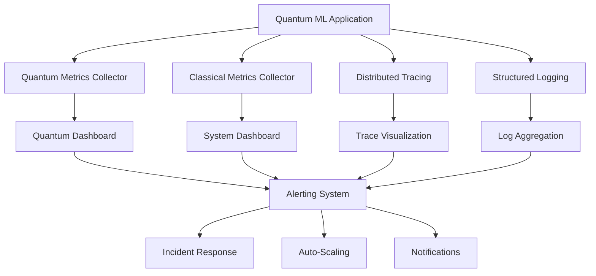

# Observability Documentation

## Overview

Observability is crucial for quantum MLOps workbenches due to the complexity of quantum computing systems, the stochastic nature of quantum measurements, and the need to monitor both classical and quantum resources. This documentation provides comprehensive guidance on monitoring, logging, tracing, and alerting for quantum machine learning environments.

## 🎯 Observability Objectives

### Core Goals
- **System Health Monitoring**: Track classical and quantum system performance
- **Quantum-Specific Metrics**: Monitor quantum circuit execution and hardware utilization
- **Predictive Analytics**: Identify issues before they impact quantum experiments
- **Performance Optimization**: Optimize quantum algorithm performance and resource usage
- **Incident Response**: Rapid detection and response to quantum system issues

### Quantum-Specific Challenges
- **Quantum State Monitoring**: Observing quantum systems without disrupting computation
- **Hardware Variability**: Monitoring quantum hardware noise and calibration drift
- **Stochastic Results**: Handling probabilistic quantum measurement outcomes
- **Resource Costs**: Optimizing expensive quantum hardware usage
- **Multi-Provider Integration**: Monitoring across different quantum cloud providers

## 📊 Observability Stack

### Architecture Overview


### Technology Stack
```yaml
# observability-stack.yml
observability_stack:
  metrics:
    collection: 
      - prometheus
      - quantum-metrics-exporter
    storage: 
      - prometheus-tsdb
      - influxdb (for high-cardinality quantum metrics)
    visualization:
      - grafana
      - quantum-dashboard
  
  logging:
    collection:
      - fluentd
      - quantum-log-processor
    storage:
      - elasticsearch
      - loki
    visualization:
      - kibana
      - grafana-loki
  
  tracing:
    collection:
      - opentelemetry
      - quantum-trace-instrumentor
    storage:
      - jaeger
      - zipkin
    visualization:
      - jaeger-ui
      - grafana-tempo
  
  alerting:
    engine:
      - alertmanager
      - quantum-alert-processor
    channels:
      - slack
      - pagerduty
      - email
      - webhook
  
  quantum_specific:
    hardware_monitoring:
      - quantum-device-monitor
      - hardware-health-checker
    circuit_analysis:
      - circuit-performance-analyzer
      - quantum-noise-tracker
    cost_optimization:
      - quantum-cost-tracker
      - usage-optimizer
```

## 🔍 Quantum-Specific Monitoring

### 1. Quantum Circuit Metrics

#### Circuit Performance Monitoring
```python
#!/usr/bin/env python3
"""
Quantum circuit performance monitoring and metrics collection
"""
import time
import json
from typing import Dict, List, Any, Optional
from dataclasses import dataclass, asdict
from datetime import datetime
import numpy as np
from prometheus_client import Counter, Histogram, Gauge, start_http_server

@dataclass
class QuantumCircuitMetrics:
    circuit_id: str
    execution_time: float
    queue_time: float
    shots: int
    qubits: int
    depth: int
    gate_count: int
    fidelity: Optional[float]
    noise_level: Optional[float]
    provider: str
    device: str
    success: bool
    error_message: Optional[str] = None

class QuantumMetricsCollector:
    def __init__(self):
        # Prometheus metrics
        self.circuit_executions = Counter(
            'quantum_circuit_executions_total',
            'Total quantum circuit executions',
            ['provider', 'device', 'status']
        )
        
        self.execution_time = Histogram(
            'quantum_circuit_execution_seconds',
            'Quantum circuit execution time',
            ['provider', 'device'],
            buckets=[0.1, 0.5, 1.0, 5.0, 10.0, 30.0, 60.0, 300.0, float('inf')]
        )
        
        self.queue_time = Histogram(
            'quantum_circuit_queue_seconds',
            'Quantum circuit queue waiting time',
            ['provider', 'device'],
            buckets=[1.0, 5.0, 30.0, 60.0, 300.0, 900.0, 1800.0, float('inf')]
        )
        
        self.circuit_depth = Histogram(
            'quantum_circuit_depth',
            'Quantum circuit depth distribution',
            ['provider'],
            buckets=[1, 5, 10, 20, 50, 100, 200, 500, float('inf')]
        )
        
        self.gate_count = Histogram(
            'quantum_circuit_gates',
            'Quantum circuit gate count',
            ['provider'],
            buckets=[1, 10, 50, 100, 500, 1000, 5000, float('inf')]
        )
        
        self.fidelity_gauge = Gauge(
            'quantum_circuit_fidelity',
            'Quantum circuit fidelity',
            ['provider', 'device', 'circuit_type']
        )
        
        self.noise_level_gauge = Gauge(
            'quantum_hardware_noise_level',
            'Quantum hardware noise level',
            ['provider', 'device']
        )
        
        self.quantum_cost = Counter(
            'quantum_cost_total',
            'Total quantum computing costs',
            ['provider', 'cost_type']
        )
    
    def record_circuit_execution(self, metrics: QuantumCircuitMetrics):
        """Record quantum circuit execution metrics"""
        # Basic execution metrics
        status = 'success' if metrics.success else 'failure'
        self.circuit_executions.labels(
            provider=metrics.provider,
            device=metrics.device,
            status=status
        ).inc()
        
        # Execution time metrics
        self.execution_time.labels(
            provider=metrics.provider,
            device=metrics.device
        ).observe(metrics.execution_time)
        
        # Queue time metrics
        self.queue_time.labels(
            provider=metrics.provider,
            device=metrics.device
        ).observe(metrics.queue_time)
        
        # Circuit complexity metrics
        self.circuit_depth.labels(
            provider=metrics.provider
        ).observe(metrics.depth)
        
        self.gate_count.labels(
            provider=metrics.provider
        ).observe(metrics.gate_count)
        
        # Quality metrics
        if metrics.fidelity is not None:
            self.fidelity_gauge.labels(
                provider=metrics.provider,
                device=metrics.device,
                circuit_type='general'  # Could be parameterized
            ).set(metrics.fidelity)
        
        if metrics.noise_level is not None:
            self.noise_level_gauge.labels(
                provider=metrics.provider,
                device=metrics.device
            ).set(metrics.noise_level)
        
        # Log detailed metrics for analysis
        self._log_circuit_metrics(metrics)
    
    def record_quantum_cost(self, provider: str, cost_type: str, amount: float):
        """Record quantum computing costs"""
        self.quantum_cost.labels(
            provider=provider,
            cost_type=cost_type
        ).inc(amount)
    
    def _log_circuit_metrics(self, metrics: QuantumCircuitMetrics):
        """Log detailed circuit metrics for analysis"""
        log_entry = {
            'timestamp': datetime.utcnow().isoformat(),
            'type': 'quantum_circuit_execution',
            'metrics': asdict(metrics)
        }
        
        # In production, send to structured logging system
        print(json.dumps(log_entry))

class QuantumHardwareMonitor:
    def __init__(self, metrics_collector: QuantumMetricsCollector):
        self.metrics_collector = metrics_collector
        self.device_status = Gauge(
            'quantum_device_status',
            'Quantum device status (1=online, 0=offline)',
            ['provider', 'device']
        )
        
        self.device_queue_length = Gauge(
            'quantum_device_queue_length',
            'Number of jobs in quantum device queue',
            ['provider', 'device']
        )
        
        self.device_calibration_age = Gauge(
            'quantum_device_calibration_age_hours',
            'Hours since last device calibration',
            ['provider', 'device']
        )
        
        self.device_error_rate = Gauge(
            'quantum_device_error_rate',
            'Quantum device error rate',
            ['provider', 'device', 'error_type']
        )
    
    def update_device_status(self, provider: str, device: str, is_online: bool):
        """Update quantum device online status"""
        self.device_status.labels(
            provider=provider,
            device=device
        ).set(1 if is_online else 0)
    
    def update_queue_length(self, provider: str, device: str, queue_length: int):
        """Update quantum device queue length"""
        self.device_queue_length.labels(
            provider=provider,
            device=device
        ).set(queue_length)
    
    def update_calibration_age(self, provider: str, device: str, hours_since_calibration: float):
        """Update hours since last calibration"""
        self.device_calibration_age.labels(
            provider=provider,
            device=device
        ).set(hours_since_calibration)
    
    def update_error_rates(self, provider: str, device: str, error_rates: Dict[str, float]):
        """Update various quantum error rates"""
        for error_type, rate in error_rates.items():
            self.device_error_rate.labels(
                provider=provider,
                device=device,
                error_type=error_type
            ).set(rate)

# Example usage and integration
class QuantumMLOpsMonitor:
    def __init__(self):
        self.metrics_collector = QuantumMetricsCollector()
        self.hardware_monitor = QuantumHardwareMonitor(self.metrics_collector)
        
        # Start Prometheus metrics server
        start_http_server(8000)
    
    def monitor_circuit_execution(self, circuit_func, *args, **kwargs):
        """Decorator/wrapper for monitoring circuit execution"""
        start_time = time.time()
        queue_start = time.time()  # Would be set when job is queued
        
        try:
            # Execute quantum circuit
            result = circuit_func(*args, **kwargs)
            
            # Calculate metrics
            execution_time = time.time() - start_time
            queue_time = start_time - queue_start  # Simplified
            
            # Create metrics object (would extract from circuit and result)
            metrics = QuantumCircuitMetrics(
                circuit_id=f"circuit_{int(time.time())}",
                execution_time=execution_time,
                queue_time=queue_time,
                shots=kwargs.get('shots', 1024),
                qubits=4,  # Would extract from circuit
                depth=10,  # Would calculate from circuit
                gate_count=20,  # Would count from circuit
                fidelity=0.95,  # Would calculate from result
                noise_level=0.01,  # Would measure/estimate
                provider='pennylane',
                device='default.qubit',
                success=True
            )
            
            self.metrics_collector.record_circuit_execution(metrics)
            return result
            
        except Exception as e:
            # Record failed execution
            metrics = QuantumCircuitMetrics(
                circuit_id=f"circuit_{int(time.time())}",
                execution_time=time.time() - start_time,
                queue_time=0,
                shots=kwargs.get('shots', 1024),
                qubits=4,
                depth=10,
                gate_count=20,
                fidelity=None,
                noise_level=None,
                provider='pennylane',
                device='default.qubit',
                success=False,
                error_message=str(e)
            )
            
            self.metrics_collector.record_circuit_execution(metrics)
            raise

# Example implementation
if __name__ == "__main__":
    monitor = QuantumMLOpsMonitor()
    
    # Example circuit execution monitoring
    def example_quantum_circuit(shots=1024):
        import time
        time.sleep(0.1)  # Simulate execution
        return {'measurement': [0, 1, 0, 1]}
    
    # Monitor circuit execution
    result = monitor.monitor_circuit_execution(example_quantum_circuit, shots=2048)
    print(f"Circuit result: {result}")
    
    # Update hardware status
    monitor.hardware_monitor.update_device_status('ibm', 'ibmq_toronto', True)
    monitor.hardware_monitor.update_queue_length('ibm', 'ibmq_toronto', 15)
    monitor.hardware_monitor.update_error_rates('ibm', 'ibmq_toronto', {
        'readout_error': 0.02,
        'gate_error': 0.001,
        'coherence_error': 0.05
    })
    
    print("Quantum monitoring system running on port 8000")
    
    # Keep server running
    try:
        while True:
            time.sleep(60)
    except KeyboardInterrupt:
        print("Shutting down monitoring system")
```

### 2. Grafana Dashboard Configuration

#### Quantum ML Operations Dashboard
```json
{
  "dashboard": {
    "id": null,
    "title": "Quantum ML Operations Dashboard",
    "tags": ["quantum", "mlops", "monitoring"],
    "style": "dark",
    "timezone": "browser",
    "refresh": "30s",
    "time": {
      "from": "now-1h",
      "to": "now"
    },
    "panels": [
      {
        "id": 1,
        "title": "Quantum Circuit Execution Rate",
        "type": "stat",
        "gridPos": {"h": 8, "w": 6, "x": 0, "y": 0},
        "targets": [
          {
            "expr": "rate(quantum_circuit_executions_total[5m])",
            "legendFormat": "Executions/sec"
          }
        ],
        "fieldConfig": {
          "defaults": {
            "color": {"mode": "thresholds"},
            "thresholds": {
              "steps": [
                {"color": "red", "value": 0},
                {"color": "yellow", "value": 0.1},
                {"color": "green", "value": 1}
              ]
            },
            "unit": "reqps"
          }
        }
      },
      {
        "id": 2,
        "title": "Circuit Success Rate",
        "type": "stat",
        "gridPos": {"h": 8, "w": 6, "x": 6, "y": 0},
        "targets": [
          {
            "expr": "rate(quantum_circuit_executions_total{status=\"success\"}[5m]) / rate(quantum_circuit_executions_total[5m]) * 100",
            "legendFormat": "Success Rate"
          }
        ],
        "fieldConfig": {
          "defaults": {
            "color": {"mode": "thresholds"},
            "thresholds": {
              "steps": [
                {"color": "red", "value": 0},
                {"color": "yellow", "value": 90},
                {"color": "green", "value": 95}
              ]
            },
            "unit": "percent",
            "min": 0,
            "max": 100
          }
        }
      },
      {
        "id": 3,
        "title": "Average Circuit Execution Time",
        "type": "graph",
        "gridPos": {"h": 8, "w": 12, "x": 12, "y": 0},
        "targets": [
          {
            "expr": "histogram_quantile(0.50, rate(quantum_circuit_execution_seconds_bucket[5m]))",
            "legendFormat": "50th percentile"
          },
          {
            "expr": "histogram_quantile(0.95, rate(quantum_circuit_execution_seconds_bucket[5m]))",
            "legendFormat": "95th percentile"
          },
          {
            "expr": "histogram_quantile(0.99, rate(quantum_circuit_execution_seconds_bucket[5m]))",
            "legendFormat": "99th percentile"
          }
        ],
        "yAxes": [
          {
            "label": "Time (seconds)",
            "min": 0
          }
        ]
      },
      {
        "id": 4,
        "title": "Quantum Device Status",
        "type": "table",
        "gridPos": {"h": 8, "w": 12, "x": 0, "y": 8},
        "targets": [
          {
            "expr": "quantum_device_status",
            "format": "table",
            "instant": true
          }
        ],
        "transformations": [
          {
            "id": "organize",
            "options": {
              "excludeByName": {"__name__": true, "job": true, "instance": true},
              "renameByName": {
                "provider": "Provider",
                "device": "Device",
                "Value": "Status"
              }
            }
          }
        ],
        "fieldConfig": {
          "overrides": [
            {
              "matcher": {"id": "byName", "options": "Status"},
              "properties": [
                {
                  "id": "custom.displayMode",
                  "value": "color-background"
                },
                {
                  "id": "mappings",
                  "value": [
                    {"options": {"0": {"color": "red", "text": "Offline"}}, "type": "value"},
                    {"options": {"1": {"color": "green", "text": "Online"}}, "type": "value"}
                  ]
                }
              ]
            }
          ]
        }
      },
      {
        "id": 5,
        "title": "Queue Length by Device",
        "type": "graph",
        "gridPos": {"h": 8, "w": 12, "x": 12, "y": 8},
        "targets": [
          {
            "expr": "quantum_device_queue_length",
            "legendFormat": "{{provider}}/{{device}}"
          }
        ],
        "yAxes": [
          {
            "label": "Jobs in Queue",
            "min": 0
          }
        ]
      },
      {
        "id": 6,
        "title": "Circuit Fidelity Distribution",
        "type": "heatmap",
        "gridPos": {"h": 8, "w": 12, "x": 0, "y": 16},
        "targets": [
          {
            "expr": "quantum_circuit_fidelity",
            "legendFormat": "{{provider}}/{{device}}"
          }
        ],
        "heatmap": {
          "xAxis": {"show": true},
          "yAxis": {"show": true, "min": 0.8, "max": 1.0},
          "colorMode": "spectrum"
        }
      },
      {
        "id": 7,
        "title": "Quantum Cost by Provider",
        "type": "piechart",
        "gridPos": {"h": 8, "w": 12, "x": 12, "y": 16},
        "targets": [
          {
            "expr": "rate(quantum_cost_total[24h])",
            "legendFormat": "{{provider}}"
          }
        ],
        "options": {
          "pieType": "donut",
          "displayLabels": ["name", "percent"]
        }
      },
      {
        "id": 8,
        "title": "Error Rates by Device",
        "type": "graph",
        "gridPos": {"h": 8, "w": 24, "x": 0, "y": 24},
        "targets": [
          {
            "expr": "quantum_device_error_rate{error_type=\"readout_error\"}",
            "legendFormat": "Readout Error - {{device}}"
          },
          {
            "expr": "quantum_device_error_rate{error_type=\"gate_error\"}",
            "legendFormat": "Gate Error - {{device}}"
          },
          {
            "expr": "quantum_device_error_rate{error_type=\"coherence_error\"}",
            "legendFormat": "Coherence Error - {{device}}"
          }
        ],
        "yAxes": [
          {
            "label": "Error Rate",
            "min": 0,
            "max": 0.1
          }
        ]
      }
    ]
  }
}
```

### 3. Log Processing and Analysis

#### Structured Quantum Logging
```python
#!/usr/bin/env python3
"""
Structured logging for quantum ML operations
"""
import json
import logging
import sys
from datetime import datetime
from typing import Dict, Any, Optional
from enum import Enum
import traceback

class LogLevel(Enum):
    DEBUG = "DEBUG"
    INFO = "INFO"
    WARNING = "WARNING"
    ERROR = "ERROR"
    CRITICAL = "CRITICAL"

class QuantumLogProcessor:
    def __init__(self, service_name: str = "quantum-mlops"):
        self.service_name = service_name
        self.logger = self._setup_logger()
    
    def _setup_logger(self) -> logging.Logger:
        """Setup structured JSON logger"""
        logger = logging.getLogger(self.service_name)
        logger.setLevel(logging.DEBUG)
        
        # Remove existing handlers
        for handler in logger.handlers[:]:
            logger.removeHandler(handler)
        
        # Create console handler with JSON formatter
        handler = logging.StreamHandler(sys.stdout)
        handler.setLevel(logging.DEBUG)
        
        # Custom JSON formatter
        formatter = QuantumJSONFormatter()
        handler.setFormatter(formatter)
        
        logger.addHandler(handler)
        return logger
    
    def log_circuit_execution(self, 
                            circuit_id: str,
                            provider: str,
                            device: str,
                            execution_details: Dict[str, Any],
                            level: LogLevel = LogLevel.INFO):
        """Log quantum circuit execution"""
        log_data = {
            "event_type": "quantum_circuit_execution",
            "circuit_id": circuit_id,
            "provider": provider,
            "device": device,
            "execution_details": execution_details,
            "quantum_metrics": {
                "shots": execution_details.get("shots"),
                "qubits": execution_details.get("qubits"),
                "depth": execution_details.get("depth"),
                "fidelity": execution_details.get("fidelity")
            }
        }
        
        self._log(level, "Quantum circuit executed", log_data)
    
    def log_hardware_event(self,
                          provider: str,
                          device: str,
                          event_type: str,
                          event_details: Dict[str, Any],
                          level: LogLevel = LogLevel.INFO):
        """Log quantum hardware events"""
        log_data = {
            "event_type": "quantum_hardware_event",
            "hardware_event_type": event_type,
            "provider": provider,
            "device": device,
            "event_details": event_details
        }
        
        self._log(level, f"Quantum hardware event: {event_type}", log_data)
    
    def log_algorithm_performance(self,
                                algorithm_name: str,
                                performance_metrics: Dict[str, Any],
                                level: LogLevel = LogLevel.INFO):
        """Log quantum algorithm performance"""
        log_data = {
            "event_type": "quantum_algorithm_performance",
            "algorithm_name": algorithm_name,
            "performance_metrics": performance_metrics,
            "quantum_advantage": performance_metrics.get("quantum_advantage"),
            "classical_comparison": performance_metrics.get("classical_comparison")
        }
        
        self._log(level, f"Algorithm performance: {algorithm_name}", log_data)
    
    def log_cost_event(self,
                      provider: str,
                      cost_type: str,
                      amount: float,
                      currency: str = "USD",
                      details: Optional[Dict[str, Any]] = None):
        """Log quantum computing cost events"""
        log_data = {
            "event_type": "quantum_cost_event",
            "provider": provider,
            "cost_type": cost_type,
            "amount": amount,
            "currency": currency,
            "cost_details": details or {}
        }
        
        self._log(LogLevel.INFO, f"Quantum cost incurred: {amount} {currency}", log_data)
    
    def log_error(self,
                 error_type: str,
                 error_message: str,
                 context: Dict[str, Any],
                 exception: Optional[Exception] = None):
        """Log quantum-specific errors"""
        log_data = {
            "event_type": "quantum_error",
            "error_type": error_type,
            "error_message": error_message,
            "context": context
        }
        
        if exception:
            log_data["exception"] = {
                "type": type(exception).__name__,
                "message": str(exception),
                "traceback": traceback.format_exc()
            }
        
        self._log(LogLevel.ERROR, f"Quantum error: {error_type}", log_data)
    
    def log_security_event(self,
                          security_event_type: str,
                          severity: str,
                          details: Dict[str, Any]):
        """Log quantum security events"""
        log_data = {
            "event_type": "quantum_security_event",
            "security_event_type": security_event_type,
            "severity": severity,
            "security_details": details
        }
        
        level = LogLevel.CRITICAL if severity == "critical" else LogLevel.WARNING
        self._log(level, f"Security event: {security_event_type}", log_data)
    
    def _log(self, level: LogLevel, message: str, extra_data: Dict[str, Any]):
        """Internal logging method"""
        log_method = getattr(self.logger, level.value.lower())
        log_method(message, extra=extra_data)

class QuantumJSONFormatter(logging.Formatter):
    """Custom JSON formatter for quantum logging"""
    
    def format(self, record: logging.LogRecord) -> str:
        log_entry = {
            "timestamp": datetime.utcnow().isoformat() + "Z",
            "level": record.levelname,
            "service": "quantum-mlops",
            "message": record.getMessage(),
            "logger": record.name,
            "module": record.module,
            "function": record.funcName,
            "line": record.lineno
        }
        
        # Add extra fields from the log record
        if hasattr(record, 'event_type'):
            log_entry.update({
                key: value for key, value in record.__dict__.items()
                if key not in ['name', 'msg', 'args', 'levelname', 'levelno', 
                              'pathname', 'filename', 'module', 'lineno', 
                              'funcName', 'created', 'msecs', 'relativeCreated',
                              'thread', 'threadName', 'processName', 'process',
                              'message', 'exc_info', 'exc_text', 'stack_info']
            })
        
        return json.dumps(log_entry, default=str)

# Example usage
if __name__ == "__main__":
    # Initialize quantum log processor
    logger = QuantumLogProcessor("quantum-mlops-demo")
    
    # Log circuit execution
    logger.log_circuit_execution(
        circuit_id="circuit_001",
        provider="ibm",
        device="ibmq_toronto",
        execution_details={
            "shots": 1024,
            "qubits": 5,
            "depth": 12,
            "gate_count": 45,
            "execution_time": 2.5,
            "queue_time": 30.0,
            "fidelity": 0.95,
            "success": True
        }
    )
    
    # Log hardware event
    logger.log_hardware_event(
        provider="aws",
        device="Aria-1",
        event_type="calibration_completed",
        event_details={
            "calibration_type": "full",
            "duration": 300.0,
            "previous_error_rate": 0.02,
            "new_error_rate": 0.015
        }
    )
    
    # Log algorithm performance
    logger.log_algorithm_performance(
        algorithm_name="QAOA_MaxCut",
        performance_metrics={
            "quantum_time": 45.0,
            "classical_time": 120.0,
            "quantum_advantage": 2.67,
            "approximation_ratio": 0.85,
            "circuit_depth": 8,
            "parameter_count": 16
        }
    )
    
    # Log cost event
    logger.log_cost_event(
        provider="ionq",
        cost_type="quantum_execution",
        amount=15.75,
        details={
            "shots": 10000,
            "device": "ionq_harmony",
            "job_id": "job_12345"
        }
    )
    
    # Log error
    try:
        raise Exception("Quantum circuit compilation failed")
    except Exception as e:
        logger.log_error(
            error_type="circuit_compilation_error",
            error_message="Failed to compile quantum circuit for target hardware",
            context={
                "circuit_id": "circuit_002",
                "target_device": "ibmq_belem",
                "compilation_level": 3
            },
            exception=e
        )
    
    # Log security event
    logger.log_security_event(
        security_event_type="credential_exposure_detected",
        severity="critical",
        details={
            "credential_type": "quantum_api_token",
            "provider": "ibm",
            "detection_method": "log_analysis",
            "mitigation_applied": True
        }
    )
```

### 4. Distributed Tracing for Quantum Workflows

#### OpenTelemetry Integration
```python
#!/usr/bin/env python3
"""
Distributed tracing for quantum ML workflows using OpenTelemetry
"""
import time
import asyncio
from typing import Dict, Any, Optional, List
from functools import wraps
import numpy as np

from opentelemetry import trace
from opentelemetry.sdk.trace import TracerProvider
from opentelemetry.sdk.trace.export import BatchSpanProcessor
from opentelemetry.exporter.jaeger.thrift import JaegerExporter
from opentelemetry.sdk.resources import Resource
from opentelemetry.trace import Status, StatusCode
from opentelemetry.semantic_conventions.trace import SpanAttributes

class QuantumTracing:
    def __init__(self, service_name: str = "quantum-mlops"):
        # Configure resource information
        resource = Resource.create({
            "service.name": service_name,
            "service.version": "0.1.0",
            "deployment.environment": "production"
        })
        
        # Set up tracer provider
        trace.set_tracer_provider(TracerProvider(resource=resource))
        tracer_provider = trace.get_tracer_provider()
        
        # Configure Jaeger exporter
        jaeger_exporter = JaegerExporter(
            agent_host_name="localhost",
            agent_port=6831,
        )
        
        # Add span processor
        span_processor = BatchSpanProcessor(jaeger_exporter)
        tracer_provider.add_span_processor(span_processor)
        
        # Get tracer
        self.tracer = trace.get_tracer(__name__)
    
    def trace_quantum_circuit(self, circuit_name: str, provider: str, device: str):
        """Decorator for tracing quantum circuit execution"""
        def decorator(func):
            @wraps(func)
            def wrapper(*args, **kwargs):
                with self.tracer.start_as_current_span(
                    f"quantum_circuit_{circuit_name}",
                    kind=trace.SpanKind.INTERNAL
                ) as span:
                    # Set span attributes
                    span.set_attributes({
                        "quantum.circuit.name": circuit_name,
                        "quantum.provider": provider,
                        "quantum.device": device,
                        "quantum.shots": kwargs.get("shots", 1024),
                        "quantum.qubits": kwargs.get("qubits", 1),
                    })
                    
                    start_time = time.time()
                    
                    try:
                        # Execute circuit
                        result = func(*args, **kwargs)
                        
                        # Record success metrics
                        execution_time = time.time() - start_time
                        span.set_attributes({
                            "quantum.execution.time": execution_time,
                            "quantum.execution.success": True,
                            "quantum.result.size": len(str(result)) if result else 0
                        })
                        
                        span.set_status(Status(StatusCode.OK))
                        return result
                        
                    except Exception as e:
                        # Record error
                        execution_time = time.time() - start_time
                        span.set_attributes({
                            "quantum.execution.time": execution_time,
                            "quantum.execution.success": False,
                            "quantum.error.type": type(e).__name__,
                            "quantum.error.message": str(e)
                        })
                        
                        span.set_status(Status(StatusCode.ERROR, str(e)))
                        span.record_exception(e)
                        raise
                        
            return wrapper
        return decorator
    
    def trace_quantum_algorithm(self, algorithm_name: str):
        """Decorator for tracing complete quantum algorithms"""
        def decorator(func):
            @wraps(func)
            async def async_wrapper(*args, **kwargs):
                with self.tracer.start_as_current_span(
                    f"quantum_algorithm_{algorithm_name}",
                    kind=trace.SpanKind.SERVER
                ) as span:
                    span.set_attributes({
                        "quantum.algorithm.name": algorithm_name,
                        "quantum.algorithm.type": "optimization"  # Could be parameterized
                    })
                    
                    try:
                        result = await func(*args, **kwargs)
                        span.set_status(Status(StatusCode.OK))
                        return result
                    except Exception as e:
                        span.set_status(Status(StatusCode.ERROR, str(e)))
                        span.record_exception(e)
                        raise
            
            @wraps(func)
            def sync_wrapper(*args, **kwargs):
                with self.tracer.start_as_current_span(
                    f"quantum_algorithm_{algorithm_name}",
                    kind=trace.SpanKind.SERVER
                ) as span:
                    span.set_attributes({
                        "quantum.algorithm.name": algorithm_name,
                        "quantum.algorithm.type": "optimization"
                    })
                    
                    try:
                        result = func(*args, **kwargs)
                        span.set_status(Status(StatusCode.OK))
                        return result
                    except Exception as e:
                        span.set_status(Status(StatusCode.ERROR, str(e)))
                        span.record_exception(e)
                        raise
            
            return async_wrapper if asyncio.iscoroutinefunction(func) else sync_wrapper
        return decorator
    
    def trace_quantum_training(self, model_name: str, epochs: int):
        """Decorator for tracing quantum ML training"""
        def decorator(func):
            @wraps(func)
            def wrapper(*args, **kwargs):
                with self.tracer.start_as_current_span(
                    f"quantum_training_{model_name}",
                    kind=trace.SpanKind.SERVER
                ) as span:
                    span.set_attributes({
                        "ml.model.name": model_name,
                        "ml.training.epochs": epochs,
                        "quantum.training.type": "variational"
                    })
                    
                    try:
                        result = func(*args, **kwargs)
                        
                        # Add training metrics if available
                        if isinstance(result, dict):
                            span.set_attributes({
                                "ml.training.final_loss": result.get("final_loss"),
                                "ml.training.accuracy": result.get("accuracy"),
                                "quantum.parameter.count": result.get("parameter_count")
                            })
                        
                        span.set_status(Status(StatusCode.OK))
                        return result
                        
                    except Exception as e:
                        span.set_status(Status(StatusCode.ERROR, str(e)))
                        span.record_exception(e)
                        raise
                        
            return wrapper
        return decorator
    
    def create_span(self, 
                   operation_name: str, 
                   span_kind: trace.SpanKind = trace.SpanKind.INTERNAL,
                   attributes: Optional[Dict[str, Any]] = None):
        """Create a manual span for custom operations"""
        span = self.tracer.start_span(operation_name, kind=span_kind)
        
        if attributes:
            span.set_attributes(attributes)
        
        return span
    
    def add_quantum_metrics_to_span(self, 
                                   span: trace.Span, 
                                   metrics: Dict[str, Any]):
        """Add quantum-specific metrics to existing span"""
        quantum_attributes = {}
        
        for key, value in metrics.items():
            if key in ['fidelity', 'noise_level', 'gate_error', 'readout_error']:
                quantum_attributes[f"quantum.{key}"] = value
            elif key in ['shots', 'qubits', 'depth', 'gate_count']:
                quantum_attributes[f"quantum.circuit.{key}"] = value
            elif key in ['cost', 'execution_time', 'queue_time']:
                quantum_attributes[f"quantum.execution.{key}"] = value
        
        span.set_attributes(quantum_attributes)

# Example usage and integration
class QuantumMLWorkflow:
    def __init__(self):
        self.tracing = QuantumTracing("quantum-ml-workflow")
    
    @QuantumTracing().trace_quantum_circuit("variational_classifier", "pennylane", "default.qubit")
    def variational_quantum_classifier(self, params: np.ndarray, X: np.ndarray, shots: int = 1024):
        """Example variational quantum classifier"""
        # Simulate quantum circuit execution
        time.sleep(0.1 + np.random.random() * 0.1)
        
        # Simulate results
        predictions = np.random.randint(0, 2, len(X))
        return {
            "predictions": predictions,
            "probabilities": np.random.random(len(X)),
            "circuit_depth": 10,
            "parameter_count": len(params)
        }
    
    @QuantumTracing().trace_quantum_algorithm("QAOA")
    async def qaoa_optimization(self, problem_graph: Dict[str, Any], layers: int = 3):
        """Example QAOA optimization algorithm"""
        with self.tracing.create_span("problem_encoding") as span:
            span.set_attributes({
                "quantum.problem.type": "max_cut",
                "quantum.problem.size": problem_graph.get("num_nodes", 0)
            })
            
            # Simulate problem encoding
            await asyncio.sleep(0.05)
        
        # Simulate parameter optimization
        for layer in range(layers):
            with self.tracing.create_span(f"layer_{layer}_optimization") as span:
                span.set_attributes({
                    "quantum.layer.index": layer,
                    "quantum.layer.type": "QAOA"
                })
                
                # Simulate optimization step
                await asyncio.sleep(0.1)
                
                # Add quantum metrics
                self.tracing.add_quantum_metrics_to_span(span, {
                    "fidelity": 0.95 - layer * 0.02,
                    "gate_count": 20 + layer * 10,
                    "execution_time": 0.5 + layer * 0.1
                })
        
        return {
            "optimal_params": np.random.random(layers * 2),
            "optimal_value": np.random.random(),
            "iterations": layers * 10
        }
    
    @QuantumTracing().trace_quantum_training("quantum_neural_network", 100)
    def train_quantum_model(self, X_train: np.ndarray, y_train: np.ndarray, epochs: int = 100):
        """Example quantum model training"""
        training_history = {"loss": [], "accuracy": []}
        
        for epoch in range(epochs):
            with self.tracing.create_span(f"training_epoch_{epoch}") as span:
                span.set_attributes({
                    "ml.training.epoch": epoch,
                    "ml.training.batch_size": len(X_train)
                })
                
                # Simulate training step
                time.sleep(0.01)
                
                # Simulate metrics
                loss = 1.0 * np.exp(-epoch * 0.05) + np.random.random() * 0.1
                accuracy = min(0.95, 0.5 + epoch * 0.01 + np.random.random() * 0.05)
                
                training_history["loss"].append(loss)
                training_history["accuracy"].append(accuracy)
                
                span.set_attributes({
                    "ml.training.epoch.loss": loss,
                    "ml.training.epoch.accuracy": accuracy
                })
        
        return {
            "final_loss": training_history["loss"][-1],
            "accuracy": training_history["accuracy"][-1],
            "parameter_count": 50,
            "training_history": training_history
        }

# Example execution
async def main():
    workflow = QuantumMLWorkflow()
    
    # Generate sample data
    X_train = np.random.random((100, 4))
    y_train = np.random.randint(0, 2, 100)
    params = np.random.random(10)
    
    # Execute traced quantum operations
    print("Executing variational quantum classifier...")
    result1 = workflow.variational_quantum_classifier(params, X_train[:10])
    print(f"Classification result: {len(result1['predictions'])} predictions")
    
    print("Executing QAOA optimization...")
    result2 = await workflow.qaoa_optimization({"num_nodes": 5}, layers=3)
    print(f"QAOA result: optimal value = {result2['optimal_value']:.3f}")
    
    print("Training quantum model...")
    result3 = workflow.train_quantum_model(X_train, y_train, epochs=10)
    print(f"Training result: final accuracy = {result3['accuracy']:.3f}")
    
    print("Tracing complete. Check Jaeger UI at http://localhost:16686")

if __name__ == "__main__":
    asyncio.run(main())
```

This comprehensive observability documentation provides the foundation for monitoring quantum MLOps workbenches. The quantum-specific metrics, dashboard configurations, structured logging, and distributed tracing ensure complete visibility into both classical and quantum aspects of the system. The templates and examples can be adapted for specific quantum computing frameworks and deployment environments.